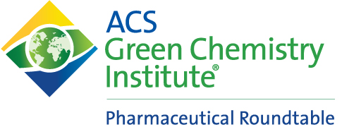

 

# PMI Predictor

Thanks to the efforts of the American Chemical Society Green Chemistry Institute Pharmaceutical Roundtable, this app calculates Process Mass Intensity (PMI) for a chemical synthesis route using the sequence of synthetic steps and step information.  The interactive [Shiny](http://shiny.rstudio.com/) app allows for interative process specification and PMI calculation from the modern web browser of your choice.

## What is Process Mass Intensity?

Process Mass Intensity (PMI) is a measure of a manufactruing process efficiency [1] [2].  To make a desired chemical compound there are often several potential synthesis routes, but each route will have a different environmental impact.  One way to measure the possible environmental impact of a process is to consider the quantity of material that must be utilized to make the desired product.  PMI is this simple efficiency measure of the ratio of input material to final product:

\\[PMI = \frac{\sum{MassOfMaterials}}{MassOfIsolatedProduct}\\]

Here \\(MassOfMaterials\\) includes the mass of process solvents, chemical reagents, and any other single-use consumables utilized in the process execution.  

While PMI cannot distinguish the impact of the individual reagents and consumables used, it provides a simple and accessible means of discriminating among a set of potential processes. For a sequence of synthetic steps to make a final product, individual step PMI values may be used to determine the cumulative PMI for the entire route to the product.  When a chemist considers different retrosynthetic routes, they must depend on their experience to know which routes are most promising and should be tested in the laboratory. To augment the chemist's personal experience with the performance of past processes, a dataset containing nearly two thousand multi-kilo scale-up reactions was created. The majority of entries (1200) were provided by eleven major pharmaceutical and biotech companies (AstraZeneca, Boehringer Ingelheim, Bristol-Myers Squibb, Eli Lilly, Merck, Novartis, Pfizer, Roche, Amgen, Genentech) and a CDMO (Asymchem) via the ACS GCI pharma roundtable. Additionally, seven hundred eighty entries were extracted from journal [OPRD](https://pubs.acs.org/journal/oprdfk) published across past three decades and representing nearly seventy pharma and biotech companies.  By defining a sequence of reactions and their corresponding reaction type, it is possible to estimate a plausible PMI for any proposed or unoptimized chemical synthesis step as well as the cumulative PMI for the multi-step route using historical information.  This ability to virtually screen different prospective routes for efficiency allows process chemists to focus their resources on a few promising synthetic approaches.  

To ensure holistic green-by-design process, the user of the PMI Predictor has also to take into account the greenness of reaction components that will be needed for each step. If the retrosynthesis requires use of highly toxic reagents or solvents, we recommend the user to select other disconnection strategies that do not require such reagents. Judicious selection of the most benign solvents and reagents, and subsequent process intensification further ensures green process development. Numerous greenness scorecards,[3],[4],[5],[6],[7] solvent [8] and reagent guides [9] available for the process chemists that can guide further reduction of the environmental impact of the synthesis

## How to use this app: 

For a real or hypothetical process, the app requests data on two tabs, and then presents plots of the results on the last tab.  Because information is passsed between tabs only when they are selected, it is best to click through the tabs in order, starting with the "Define Process" tab.

### Define your process

On the "Define Process" tab, enter each molecular transformation, specifying the stoichiometry and direct product of each reagent or intermediate in the process. The sequence and branch points will automatically be infered from these relationships. If a reagent is not limiting, enter the stoichiometry (or a range if there is uncertainty) of the reagent charge for that step.  For labeling compounds, the letters A-Z are offered as selectable identifiers.  However, custom names may be entered for each of the species.  Each transformation is listed as a seperate row, one for each of the tracked inputs.  The process data may be downloaded for reference using the "Download Process Info as RDS file" button.  Similarly, process information may be restored using the upload button, and clicking through the tabs to load the data into the fields.

### Add some information on the steps and intermediates

On the second "PMI Values" tab, enter the molecular weight and reaction details for each of the synthetic steps.  A preset dropdown is available to use historical ranges (the 25%-75% inter-quartile range) of PMI and yield for specific classes of reactions.  For entering custom ranges product yield and step PMI values may be entered. Step PMI is defined as the mass of all inputs to the process (solvents, process aids, and other consumables) per mass of step product.  A graph of the process sequence will be generated to confirm the information entered on the "Define Process" tab.

### Calculate and view the results

On the third "Results" tab, there are buttons for starting the Monte Carlo calculation of PMI, as well as the option to download the simulation results.  The checkbox for advanced options allows access for adjusting the simulation options:
 
 - **Number of Monte Carlo simulations**: 5000 iterations is the default to balance between calculation time and result quality.

 - **Min and Max definitions**:  For the values of step PMI and Yield, the "Min" and "Max" are defined by default to the 99% intervals of a normal distribution.  To change the interval another value, such as 95% or 50%, you may do so here.  The Min and Max range inputs of Stoichiometry is always assumed to have a uniform distribution.

 - **Correlation between PMI and Yield**: PMI and Yield have a moderate negative correlation (-0.53) from our analysis.  This correlation is used to simulate a more realistic range of process performance.

Once the calculation has been run, the plotted results will automatically be displayed.  A button to download the raw Monte Carlo samples is available if a more customized analysis is needed.  To save the plot images you may right click on the image to save to your computer/tablet/phone.  There are three tabs to show different views of the data:

 - **Overall PMI** A histogram of the cumulative PMI for the whole process, 95% intervals are displayed.  This plot is the main product of the app.

 - **Step Metrics** A view of the different contributions to PMI.  Distributions of the mass to produce final product are displayed for each of the intermediates along with the range of total material needed.  Useful for determining the necessary quantity of intermediates to make a quantity of product.

 - **Step Yield vs Step PMI** Plots are generated to show the correlation between PMI and Yield for each of the reaction products.  Useful to explore the potential performance of individual reactions.

## Update History

 - April 2019: Reaction ranges updated with additional data
 - July 2019: Expanded README and added Travis CI

## Acknowledgements

*developed as part of the ACS Green Chemistry Institute Pharmaceutical Roundtable, June 2018*

*app created by Jacob Albrecht, Bristol-Myers Squibb jacob.albrecht@bms.com*

*app concept and design contributions from Jun Li, Alina Borovika, Martin Eastgate, Bristol-Myers Squibb*

## References

1) Jun Li, Jacob Albrecht, Alina Borovika, and Martin D. Eastgate, "Evolving Green Chemistry Metrics into Predictive Tools for Decision Making and Benchmarking Analytics" *ACS Sustainable Chem. Eng.*, **2018** [10.1021/acssuschemeng.7b03407](https://dx.doi.org/10.1021/acssuschemeng.7b03407)

2) Jun Li, Eric M. Simmons, and  Martin D. Eastgate, "A data-driven strategy for predicting greenness scores, rationally comparing synthetic routes and benchmarking PMI outcomes for the synthesis of molecules in the pharmaceutical industry" *Green Chemistry*, **2017** [10.1039/c6gc02359b](https://dx.doi.org/10.1039/c6gc02359b)

3) Roschangar, F., Zhou, Y., Constable, D. J. C., Colberg, J., Dickson, D. P., Dunn, J. P., Eastgate, M. D., Gallou, F., Hayler, J. D., Koenig, S. G., Kopach, M. E., Leahy, D. K., Mergelsberg, I., Scholz, U., Smith, A. G., Henry, M., Mulder, J., Brandenburg, J., Dehli, J. R., Fandrick, D. R., Fandrick, K. R., Gnad-Badouin, F., Zerban, G., Groll, K., Anastas, P. T., Sheldon, R. A., Senanayake, C. H. Inspiring process innovation via an improved green manufacturing metric: iGAL. Green Chem. 20, 2206-2211(2018).

4) F. Roschangar and J. Colberg, Green Chemistry Metrics, in Green Techniques for Organic Synthesis and Medicinal Chemistry, ed. W. Zhang and B. W. Cue, John Wiley & Sons, Chichester, UK, 2018.

5) R. C. McElroy, A. Constantinou, L. C. Jones, L. Summerton and J. H. Clark. Towards a holistic approach to metrics for the 21st century pharmaceutical industry, Green Chem., 2015, 17, 3111-3121.

6) J. Andraos, M. L. Mastronardi, L. B. Hoch, A. Hent, Critical Evaluation of Published Algorithms for Determining Environmental and Hazard Impact Green Metrics of Chemical Reactions and Synthesis Plans, ACS Sustainable Chem. Eng. 2016, 4, 1934-1945.

7) Leahy, D. K., Simmons, E. M., Hung, V., Sweeney, J. T., Fleming, W. F., Miller, M. Design and evolution of the BMS process greenness scorecard. Green Chem., 2017, 19, 5163-5171.

8) Solvent selection guides and tools:
http://learning.chem21.eu/methods-of-facilitating-change/tools-and-guides/solvent-selection-guides/guide-tables/,  https://www.acsgcipr.org/tools-for-innovation-in-chemistry/solvent-tool/

9) Reagent guides:
https://reagents.acsgcipr.org/